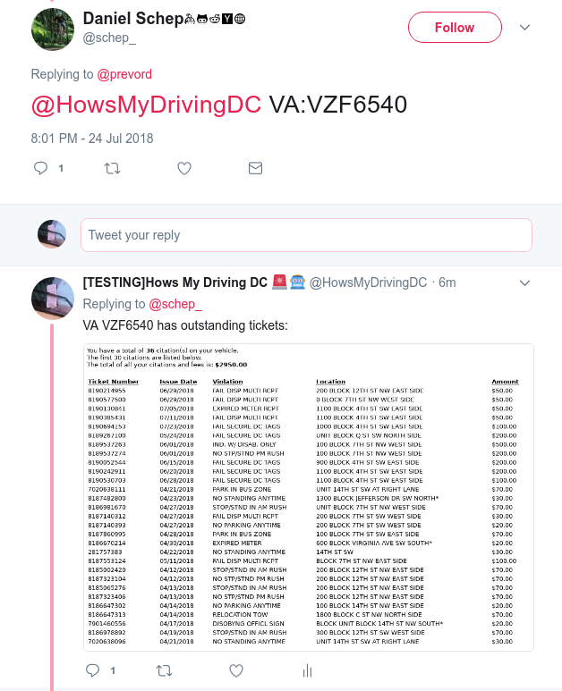

# Hows My Driving DC Twitter Bot

Uses pupeteer(for interacting with the DMV form) and tesseract.js(for solving the captcha) on lambda.

This is the form used: https://prodpci.etimspayments.com/pbw/include/dc_parking/input.jsp

## Deploy
```
npm i -g serverless
npm i
sls deploy
```

Bootstraped from https://github.com/sambaiz/puppeteer-lambda-starter-kit
## Press
 * [2018-09-10 - Washingtonian](https://www.washingtonian.com/2018/09/10/twitter-bot-finds-worst-dc-drivers-parking/)
 * [2018-09-20 - Washignton Post](https://www.washingtonpost.com/local/trafficandcommuting/hows-dc-driving-this-new-tool-instantly-reveals-any-drivers-traffic-violations/2018/09/19/860d8fea-bb8d-11e8-9812-a389be6690af_story.html)
 * [2018-10-31 - ABC7](https://twitter.com/schep_/status/1058350082490294274)

## Archiver
There's a script for archiving the bot's history to a sqlite db. run it like this:
```
sls invoke local  -f archive
```
I've even checked in the sqlite db for other to peruse:
https://github.com/dschep/hows-my-driving-dc/blob/master/archive.db

## Screenshot



## Backstory?
Curious how @howsmydrivingdc came to be? [Here's a short story in the form of twitter screenshots](https://github.com/dschep/hows-my-driving-dc/issues/4#issuecomment-407921395).
